# Python CLI Command Execution Flows

This document provides detailed step-by-step execution flows for every Python CLI command. Each diagram shows exactly what happens under the hood when you run a command, including internal method calls, RPC communication, and data flow.

## Table of Contents

1. [Connection Commands](#connection-commands)
2. [Peer Management Commands](#peer-management-commands)
3. [Streaming Commands](#streaming-commands)
4. [Chat Commands](#chat-commands)
5. [Voice Commands](#voice-commands)
6. [Video Commands](#video-commands)
7. [Compute Commands](#compute-commands)
8. [AI Commands](#ai-commands)
9. [Test Commands](#test-commands)
10. [DCDN Commands](#dcdn-commands)

---

## Connection Commands

### `python main.py connect`

**Purpose**: Connect to a Go node and test the connection

```mermaid
sequenceDiagram
    participant User
    participant CLI as cli.py::connect()
    participant Client as GoNodeClient
    participant Schema as schema.capnp
    participant Loop as AsyncIO Event Loop
    participant Network as TCP Socket
    participant GoNode as Go Node RPC Service

    User->>CLI: python main.py connect --host localhost --port 8080
    CLI->>CLI: Parse options (host, port, schema)
    CLI->>CLI: get_go_schema_path() if schema is None
    CLI->>Client: __init__(host, port, schema_path)
    Client->>Client: Initialize connection state
    
    CLI->>Client: connect()
    Client->>Loop: Create new event loop
    Client->>Loop: Start event loop in background thread
    Client->>Client: _async_connect()
    Client->>Schema: capnp.load(schema_path)
    Schema-->>Client: Loaded schema with NodeService
    Client->>Network: AsyncIoStream.create_connection(host, port)
    Network-->>Client: Connected socket
    Client->>Client: TwoPartyClient(sock)
    Client->>GoNode: bootstrap().cast_as(NodeService)
    GoNode-->>Client: NodeService RPC interface
    Client->>CLI: Return True (connected)
    
    CLI->>Client: get_all_nodes()
    Client->>Client: _async_get_all_nodes()
    Client->>GoNode: service.getAllNodes()
    GoNode-->>Client: NodeList response
    Client->>Client: Parse nodes to List[Dict]
    Client->>CLI: Return nodes list
    
    CLI->>User: Display "✅ Connected" + node count
    
    CLI->>Client: disconnect()
    Client->>Loop: Stop event loop
    Client->>Loop: Join thread
    Client->>User: Connection closed
```

**Key Internal Calls**:
- `cli.py::connect()` → `GoNodeClient.__init__()` → `GoNodeClient.connect()`
- `GoNodeClient.connect()` → `capnp.load()` → `AsyncIoStream.create_connection()`
- `GoNodeClient.get_all_nodes()` → `service.getAllNodes()` [RPC]
- `GoNodeClient.disconnect()` → `loop.stop()`

---

### `python main.py list-nodes`

**Purpose**: List all nodes from the Go node


**Key Internal Calls**:
- `cli.py::list_nodes()` → `GoNodeClient.connect()` → `GoNodeClient.get_all_nodes()`
- `GoNodeClient.get_all_nodes()` → `asyncio.run_coroutine_threadsafe(_async_get_all_nodes(), loop)`
- `_async_get_all_nodes()` → `service.getAllNodes()` [RPC Call]
- Response parsing: `node.id`, `node.status`, `node.latencyMs`, `node.threatScore`

---

## Peer Management Commands

### `python main.py connect-peer`

**Purpose**: Connect to a new peer via the Go node


**Key Internal Calls**:
- `cli.py::connect_peer()` → `GoNodeClient.connect_to_peer(peer_id, host, port)`
- `connect_to_peer()` → `schema.PeerAddress.new_message()`
- `connect_to_peer()` → `service.connectToPeer(peer)` [RPC]
- Go side: `connectToPeer()` → `libp2p.Connect()` → NAT traversal
- Response: Quality metrics (latency, jitter, packet loss)

---

### `python main.py update-threat`

**Purpose**: Update threat score for a node

```mermaid
sequenceDiagram
    participant User
    participant CLI as cli.py::update_threat()
    participant Client as GoNodeClient
    participant Schema as NodeUpdate
    participant GoNode as Go Node RPC
    participant NodeStore as Go Node Storage

    User->>CLI: python main.py update-threat 2 0.75
    CLI->>CLI: Parse arguments (node_id, threat_score)
    CLI->>Client: connect()
    
    CLI->>Client: update_threat_score(node_id, threat_score)
    Client->>Client: Check _connected flag
    Client->>Client: _async_update()
    Client->>Schema: NodeUpdate.new_message()
    Client->>Schema: Set nodeId = node_id
    Client->>Schema: Set threatScore = threat_score
    Client->>GoNode: service.updateNode(update) [RPC]
    GoNode->>NodeStore: Update threat score in storage
    NodeStore-->>GoNode: Success
    GoNode-->>Client: result.success = true
    Client-->>CLI: Return True
    
    CLI->>User: Display "✅ Updated threat score"
    CLI->>Client: disconnect()
```



**Key Internal Calls**:
- `cli.py::update_threat()` → `GoNodeClient.update_threat_score(node_id, score)`
- `update_threat_score()` → `schema.NodeUpdate.new_message()`
- `update_threat_score()` → `service.updateNode(update)` [RPC]
- Go side: `updateNode()` → Update node storage → Return success

---

## Streaming Commands

### `python main.py streaming start`

**Purpose**: Start streaming service (video/audio/chat)


**Key Internal Calls**:
- `cli.py::streaming::start()` → Type mapping → `GoNodeClient.start_streaming()`
- `start_streaming()` → `schema.StreamConfig.new_message()`
- `start_streaming()` → `service.startStreaming(config)` [RPC]
- Go side: `startStreaming()` → `libp2p.NewStream()` → UDP/QUIC transport

---

## Chat Commands

### `python main.py chat send`

**Purpose**: Send a chat message to a peer


**Key Internal Calls**:
- `cli.py::chat::send()` → `GoNodeClient.send_chat_message(peer_id, message)`
- `send_chat_message()` → `schema.ChatMessage.new_message()`
- `send_chat_message()` → `service.sendChatMessage(msg)` [RPC]
- Go side: `sendChatMessage()` → `libp2p.NewStream("/chat/1.0.0")` → Send → Save history

---

## Compute Commands

### `python main.py compute submit`

**Purpose**: Submit a distributed compute job


**Key Internal Calls**:
- `cli.py::compute::submit()` → Read file → Define job
- `ComputeClient.submit_job()` → Generate job_id → `service.submitComputeJob()` [RPC]
- Go: `submitComputeJob()` → Task scheduler → Rust executor
- Rust: WASM sandbox → Execute → Return
- `ComputeClient.get_result()` → `service.getComputeJobResult()` [RPC]
- Job flow: Split (Python) → Execute (Rust/WASM) → Merge (Go/Python)

---

## Test Commands

### `python main.py test ces`

**Purpose**: Test CES compute pipeline (Compress → Encrypt → Shard)

```mermaid
sequenceDiagram
    participant User
    participant CLI as cli.py::test::ces()
    participant Client as GoNodeClient
    participant GoNode as Go Node RPC
    participant Rust as Rust CES Pipeline

    User->>CLI: python main.py test ces --size 5000
    CLI->>Client: connect()
    
    CLI->>CLI: Generate test_data (size bytes)
    CLI->>User: Display "📦 Test data size"
    
    CLI->>Client: ces_process(test_data, compression_level=3)
    Client->>GoNode: cesProcess(data, compression_level) [RPC]
    GoNode->>Rust: Forward to Rust CES
    Rust->>Rust: Brotli compression
    Rust->>Rust: XChaCha20Poly1305 encryption
    Rust->>Rust: Reed-Solomon sharding
    Rust-->>GoNode: shards list
    GoNode-->>Client: shards
    Client-->>CLI: shards (List[bytes])
    
    CLI->>CLI: Calculate compression ratio
    CLI->>User: Display "✅ Created N shards" + stats
    
    CLI->>Client: ces_reconstruct(shards, shard_present, compression_level=3)
    Client->>GoNode: cesReconstruct(shards, shard_present, level) [RPC]
    GoNode->>Rust: Forward to Rust CES
    Rust->>Rust: Reed-Solomon reconstruction
    Rust->>Rust: XChaCha20Poly1305 decryption
    Rust->>Rust: Brotli decompression
    Rust-->>GoNode: original_data
    GoNode-->>Client: reconstructed bytes
    Client-->>CLI: reconstructed
    
    CLI->>CLI: Verify reconstructed == test_data
    
    alt Data matches
        CLI->>User: Display "✅ Data integrity verified!"
    else Data mismatch
        CLI->>User: Display "❌ Data mismatch!"
        CLI->>CLI: sys.exit(1)
    end
    
    CLI->>Client: disconnect()
    CLI->>User: Display "✅ CES compute test PASSED!"
```



**Key Internal Calls**:
- `cli.py::test::ces()` → Generate test data
- `GoNodeClient.ces_process()` → `service.cesProcess()` [RPC] → Rust CES
- Rust: Compress → Encrypt → Shard
- `GoNodeClient.ces_reconstruct()` → `service.cesReconstruct()` [RPC] → Rust CES
- Rust: Reconstruct → Decrypt → Decompress
- Verify data integrity

---

## Common Patterns

### RPC Call Pattern (GoNodeClient)

All RPC calls in `GoNodeClient` follow this pattern:

```python
def method_name(self, args) -> ReturnType:
    """Method documentation."""
    if not self._connected:
        raise RuntimeError("Not connected to Go node")
    
    async def _async_method():
        # Create request message if needed
        request = self.schema.RequestType.new_message()
        request.field = value
        
        # Make RPC call
        result = await self.service.rpcMethodName(request)
        
        # Parse and return result
        return parse_result(result)
    
    try:
        future = asyncio.run_coroutine_threadsafe(_async_method(), self._loop)
        return future.result(timeout=5.0)
    except Exception as e:
        logger.error(f"Error: {e}")
        return fallback_value
```

### Connection Lifecycle

1. **Initialize**: `GoNodeClient(host, port, schema_path)`
2. **Connect**: 
   - Create event loop
   - Start background thread
   - Load Cap'n Proto schema
   - Establish TCP connection
   - Bootstrap RPC interface
3. **Use**: Make RPC calls via async wrappers
4. **Disconnect**: 
   - Stop event loop
   - Join background thread
   - Clean up resources

### Error Handling

- All CLI commands have try/except blocks
- RPC failures return `False` or `None`
- Connection errors display troubleshooting tips
- Timeouts use configurable values (typically 5-30 seconds)

---

## Related Documentation

- [Architecture Blueprint](./diagrams/ARCHITECTURE_BLUEPRINT.md) - High-level system architecture
- [CLI Guide](../python/README.md) - Python CLI usage guide
- [Go RPC Service](../go/capnp_service.go) - Go RPC implementation
- [Cap'n Proto Schema](../go/schema.capnp) - RPC interface definitions
- [Compute System](./COMPUTE_SYSTEM.md) - Distributed compute details
- [Communication](./COMMUNICATION.md) - P2P communication details

---

## Summary

This document shows the complete execution flow for every Python CLI command. Key takeaways:

1. **Layered Architecture**: CLI → GoNodeClient → RPC → Go Services → Rust/LibP2P
2. **Async Pattern**: All RPC calls use asyncio with background event loop
3. **Cap'n Proto**: All communication uses structured RPC messages
4. **Golden Rule Compliance**: 
   - Python: High-level commands, AI, preprocessing
   - Go: All networking, orchestration, RPC
   - Rust: Compute, encryption, compression
5. **Error Handling**: Graceful failures with informative messages

Each command follows a consistent pattern: parse options → connect → RPC call(s) → display results → disconnect.
