# Pangea Net - Technical Schematics Architecture

This is a comprehensive "Technical Schematics" diagram showing the entire Pangea Net architecture as a machine blueprint with FontAwesome icons, grouped machine components, and mechanical aesthetics.

## Machine Groups Legend

- **⚙️ CLI_CONTROL_PANEL**: Main execution entry points and command interfaces
- **🗜️ INGESTION_ENGINE**: Data compression and preprocessing machinery
- **🔐 SECURITY_VAULT**: Encryption chambers and cryptographic verification systems
- **🌐 TRANSMISSION_PIPE**: Network infrastructure, P2P mesh, and Tor routing
- **⚙️ COMPUTE_FACTORY**: Task execution, resource metering, and distributed computing
- **🗄️ STORAGE_FACILITY**: Persistent data storage and caching systems
- **🧠 AI_INTELLIGENCE_CORE**: Machine learning models and federated training

## Icon System

- **fa:fa-terminal / fa:fa-power-off**: CLI and main entry points
- **fa:fa-compress / fa:fa-cogs**: Compression and codec machinery
- **fa:fa-lock / fa:fa-shield-alt**: Encryption and security systems
- **fa:fa-globe / fa:fa-network-wired**: Network, Tor, and P2P infrastructure
- **fa:fa-database**: Storage and persistence components
- **fa:fa-brain**: AI and machine learning modules
- **fa:fa-exchange-alt**: Interface bridges and IPC mechanisms
- **fa:fa-server**: Microservice containers
- **fa:fa-comments / fa:fa-video / fa:fa-microphone**: Communication channels

## Mermaid Diagram

```mermaid
flowchart TD
    %% ========================================
    %% MACHINE CLASS DEFINITIONS - Blueprint Aesthetics
    %% ========================================
    classDef machine fill:#f9f9f9,stroke:#333,stroke-width:2px,color:#000
    classDef ingestion fill:#ffa726,stroke:#e65100,stroke-width:3px,color:#000
    classDef security fill:#ffeb3b,stroke:#f57f17,stroke-width:4px,color:#000
    classDef network fill:#42a5f5,stroke:#0d47a1,stroke-width:3px,color:#fff
    classDef compute fill:#ef5350,stroke:#b71c1c,stroke-width:3px,color:#fff
    classDef storage fill:#66bb6a,stroke:#1b5e20,stroke-width:3px,color:#fff
    classDef ai fill:#ec407a,stroke:#880e4f,stroke-width:3px,color:#fff
    classDef control fill:#26c6da,stroke:#006064,stroke-width:3px,color:#fff
    
    %% ========================================
    %% MACHINE GROUP: CLI_CONTROL_PANEL
    %% ========================================
    subgraph CLI_CONTROL["⚙️ CLI_CONTROL_PANEL"]
        DESKTOP_KIVY["fa:fa-terminal Desktop App<br/>KivyMD GUI"]
        DESKTOP_TK["fa:fa-terminal Desktop App<br/>Tkinter GUI"]
        PYTHON_CLI["fa:fa-terminal Python CLI<br/>Command Interface"]
        GO_MAIN["fa:fa-power-off Go Node Main<br/>Entry Point"]
        RUST_MAIN["fa:fa-power-off Rust Node Main<br/>Entry Point"]
    end
    
    %% ========================================
    %% MACHINE GROUP: INGESTION_ENGINE
    %% ========================================
    subgraph INGESTION_ENGINE["🗜️ INGESTION_ENGINE"]
        RUST_CES["fa:fa-compress CES Pipeline<br/>Compression Engine"]
        RUST_CODECS["fa:fa-cogs Media Codecs<br/>Opus/Brotli"]
        PYTHON_PREPROCESSOR["fa:fa-compress Data Preprocessor<br/>Input Preparation"]
    end
    
    %% ========================================
    %% MACHINE GROUP: SECURITY_VAULT
    %% ========================================
    subgraph SECURITY_VAULT["🔐 SECURITY_VAULT"]
        RUST_ENCRYPTION["fa:fa-lock XChaCha20Poly1305<br/>Encryption Chamber"]
        GO_SECURITY["fa:fa-shield-alt Security Manager<br/>Encryption & Keys"]
        DCDN_VERIFIER["fa:fa-lock Signature Verifier<br/>Ed25519 Auth"]
        RUST_COMPUTE_VERIFY["fa:fa-shield-alt Merkle Verifier<br/>Result Integrity"]
    end
    
    %% ========================================
    %% MACHINE GROUP: TRANSMISSION_PIPE
    %% ========================================
    subgraph TRANSMISSION_PIPE["🌐 TRANSMISSION_PIPE"]
        GO_LIBP2P["fa:fa-network-wired LibP2P Network<br/>NAT Traversal"]
        GO_STREAMING["fa:fa-globe Streaming Service<br/>Video/Audio/Chat"]
        GO_NETWORK_ADAPTER["fa:fa-network-wired Network Adapter<br/>Multi-Protocol"]
        GO_PROXY["fa:fa-globe SOCKS5/Tor Proxy<br/>Anonymous Routing"]
        GO_DHT["fa:fa-network-wired DHT Discovery<br/>Peer Routing"]
        RUST_DHT["fa:fa-globe Rust DHT<br/>Content Routing"]
        DCDN_QUIC["fa:fa-network-wired QUIC Transport<br/>Low-Latency UDP"]
        DCDN_P2P["fa:fa-globe P2P Engine<br/>Mesh Network"]
    end
    
    %% ========================================
    %% MACHINE GROUP: COMPUTE_FACTORY
    %% ========================================
    subgraph COMPUTE_FACTORY["⚙️ COMPUTE_FACTORY"]
        GO_COMPUTE_MGR["fa:fa-cogs Compute Manager<br/>Task Scheduler"]
        RUST_UPLOAD["fa:fa-cogs Upload Protocol<br/>CES + Transport"]
        RUST_DOWNLOAD["fa:fa-cogs Download Protocol<br/>CES + Reconstruct"]
        RUST_COMPUTE_EXEC["fa:fa-cogs Task Executor<br/>MapReduce"]
        RUST_COMPUTE_SANDBOX["fa:fa-cogs WASM Sandbox<br/>Secure Execution"]
        RUST_COMPUTE_METER["fa:fa-cogs Resource Metering<br/>CPU/Memory Limits"]
        DCDN_FEC["fa:fa-cogs FEC Engine<br/>Reed-Solomon"]
        GO_ML_COORD["fa:fa-cogs ML Coordinator<br/>Distributed ML"]
    end
    
    %% ========================================
    %% MACHINE GROUP: STORAGE_FACILITY
    %% ========================================
    subgraph STORAGE_FACILITY["🗄️ STORAGE_FACILITY"]
        GO_SHARED_MEM["fa:fa-database Shared Memory<br/>Go↔Python IPC"]
        GO_CONFIG["fa:fa-database Config Manager<br/>Persistence"]
        GO_NODE_STORE["fa:fa-database Node Store<br/>Peer Database"]
        RUST_CACHE["fa:fa-database File Cache<br/>Manifest Store"]
        DCDN_STORAGE["fa:fa-database Chunk Store<br/>Ring Buffer"]
    end
    
    %% ========================================
    %% MACHINE GROUP: AI_INTELLIGENCE_CORE
    %% ========================================
    subgraph AI_CORE["🧠 AI_INTELLIGENCE_CORE"]
        AI_PREDICTOR["fa:fa-brain Threat Predictor<br/>CNN Model"]
        AI_SHARD["fa:fa-brain Shard Optimizer<br/>ML-based CES"]
        AI_TRANSLATION["fa:fa-brain Translation Pipeline<br/>ASR → NMT → TTS"]
        AI_LIPSYNC["fa:fa-brain Video Lipsync<br/>AV Sync"]
        AI_FEDERATED["fa:fa-brain Federated Learning<br/>P2P-FL & CSM"]
    end
    
    %% ========================================
    %% INTERFACE BRIDGES
    %% ========================================
    GO_CAPNP["fa:fa-exchange-alt Cap'n Proto RPC<br/>IPC Service"]
    RUST_FFI["fa:fa-exchange-alt FFI Bridge<br/>Go ↔ Rust"]
    PYTHON_GO_CLIENT["fa:fa-exchange-alt Go RPC Client<br/>Cap'n Proto"]
    PYTHON_COMPUTE_CLIENT["fa:fa-exchange-alt Compute Client<br/>Job Management"]
    
    %% ========================================
    %% NETWORKING - Tor Tunnels & Proxies
    %% ========================================
    SERVICE_GO_ORCH["fa:fa-server Go Orchestrator<br/>Service Entry"]
    SERVICE_PYTHON_AI["fa:fa-server Python AI Client<br/>Service Entry"]
    SERVICE_RUST_COMPUTE["fa:fa-server Rust Compute<br/>Service Entry"]
    
    %% ========================================
    %% COMMUNICATION CHANNELS
    %% ========================================
    PYTHON_COMM_CHAT["fa:fa-comments Live Chat<br/>P2P Messaging"]
    PYTHON_COMM_VIDEO["fa:fa-video Live Video<br/>UDP Streaming"]
    PYTHON_COMM_VOICE["fa:fa-microphone Live Voice<br/>Audio Streaming"]
    
    %% ========================================
    %% WIRING - Solid arrows for working connections
    %% ========================================
    
    %% Entry Points to Core Services
    DESKTOP_KIVY --> PYTHON_GO_CLIENT
    DESKTOP_TK --> PYTHON_GO_CLIENT
    PYTHON_CLI --> PYTHON_GO_CLIENT
    PYTHON_CLI --> PYTHON_COMPUTE_CLIENT
    
    %% Python to Go RPC Bridge
    PYTHON_GO_CLIENT --> GO_CAPNP
    PYTHON_COMPUTE_CLIENT --> GO_CAPNP
    
    %% Go Main Orchestration
    GO_MAIN --> GO_CAPNP
    GO_MAIN --> GO_LIBP2P
    GO_MAIN --> GO_NODE_STORE
    GO_MAIN --> GO_CONFIG
    GO_MAIN --> GO_SHARED_MEM
    
    %% Go to Rust FFI Bridge
    GO_CAPNP --> RUST_FFI
    RUST_FFI --> RUST_CES
    RUST_FFI --> RUST_UPLOAD
    RUST_FFI --> RUST_DOWNLOAD
    
    %% CES Pipeline Flow (Compression → Encryption → Sharding)
    RUST_CES --> RUST_CODECS
    RUST_CODECS --> RUST_ENCRYPTION
    RUST_ENCRYPTION --> RUST_UPLOAD
    RUST_UPLOAD --> RUST_CACHE
    
    %% Download Flow (Retrieval → Decryption → Decompression)
    RUST_DOWNLOAD --> RUST_CACHE
    RUST_CACHE --> RUST_ENCRYPTION
    RUST_ENCRYPTION --> RUST_CODECS
    
    %% DCDN Architecture
    RUST_MAIN --> DCDN_QUIC
    DCDN_QUIC --> DCDN_FEC
    DCDN_FEC --> DCDN_STORAGE
    DCDN_STORAGE --> DCDN_P2P
    DCDN_P2P --> DCDN_VERIFIER
    
    %% Compute System
    GO_COMPUTE_MGR --> RUST_COMPUTE_EXEC
    RUST_COMPUTE_EXEC --> RUST_COMPUTE_SANDBOX
    RUST_COMPUTE_SANDBOX --> RUST_COMPUTE_METER
    RUST_COMPUTE_EXEC --> RUST_COMPUTE_VERIFY
    
    %% Networking & Security
    GO_LIBP2P --> GO_NETWORK_ADAPTER
    GO_NETWORK_ADAPTER --> GO_PROXY
    GO_LIBP2P --> GO_DHT
    GO_SECURITY --> GO_CAPNP
    GO_STREAMING --> GO_LIBP2P
    
    %% Python AI Integration
    PYTHON_GO_CLIENT --> AI_PREDICTOR
    PYTHON_GO_CLIENT --> AI_SHARD
    PYTHON_PREPROCESSOR --> AI_TRANSLATION
    AI_TRANSLATION --> AI_LIPSYNC
    AI_FEDERATED --> GO_ML_COORD
    GO_ML_COORD --> GO_COMPUTE_MGR
    
    %% Communication Layer
    PYTHON_CLI --> PYTHON_COMM_CHAT
    PYTHON_CLI --> PYTHON_COMM_VIDEO
    PYTHON_CLI --> PYTHON_COMM_VOICE
    PYTHON_COMM_CHAT --> GO_STREAMING
    PYTHON_COMM_VIDEO --> GO_STREAMING
    PYTHON_COMM_VOICE --> GO_STREAMING
    
    %% Services Architecture
    SERVICE_GO_ORCH --> GO_CAPNP
    SERVICE_PYTHON_AI --> PYTHON_GO_CLIENT
    SERVICE_RUST_COMPUTE --> RUST_COMPUTE_EXEC
    
    %% Data Flow Connections
    RUST_UPLOAD --> GO_NETWORK_ADAPTER
    GO_NETWORK_ADAPTER --> GO_LIBP2P
    GO_LIBP2P --> DCDN_P2P
    
    RUST_DHT --> RUST_CACHE
    GO_DHT --> GO_NODE_STORE
    
    %% Python Preprocessing
    PYTHON_PREPROCESSOR --> RUST_CES
    
    %% ========================================
    %% FUTURE ENHANCEMENTS - Dotted Lines
    %% ========================================
    RUST_DHT -.->|Future: Direct DHT| DCDN_P2P
    AI_SHARD -.->|Future: ML Optimization| RUST_CES
    GO_PROXY -.->|Optional: Tor Integration| GO_NETWORK_ADAPTER
    
    %% ========================================
    %% APPLY MACHINE STYLING TO GROUPS
    %% ========================================
    
    %% Control Panel Components
    class DESKTOP_KIVY,DESKTOP_TK,PYTHON_CLI,GO_MAIN,RUST_MAIN control
    
    %% Ingestion Engine Components
    class RUST_CES,RUST_CODECS,PYTHON_PREPROCESSOR ingestion
    
    %% Security Vault Components
    class RUST_ENCRYPTION,GO_SECURITY,DCDN_VERIFIER,RUST_COMPUTE_VERIFY security
    
    %% Transmission Pipe Components
    class GO_LIBP2P,GO_STREAMING,GO_NETWORK_ADAPTER,GO_PROXY,GO_DHT,RUST_DHT,DCDN_QUIC,DCDN_P2P network
    
    %% Compute Factory Components
    class GO_COMPUTE_MGR,RUST_UPLOAD,RUST_DOWNLOAD,RUST_COMPUTE_EXEC,RUST_COMPUTE_SANDBOX,RUST_COMPUTE_METER,DCDN_FEC,GO_ML_COORD compute
    
    %% Storage Facility Components
    class GO_SHARED_MEM,GO_CONFIG,GO_NODE_STORE,RUST_CACHE,DCDN_STORAGE storage
    
    %% AI Intelligence Core Components
    class AI_PREDICTOR,AI_SHARD,AI_TRANSLATION,AI_LIPSYNC,AI_FEDERATED ai
    
    %% Bridge Components
    class GO_CAPNP,RUST_FFI,PYTHON_GO_CLIENT,PYTHON_COMPUTE_CLIENT network
    
    %% Service Components
    class SERVICE_GO_ORCH,SERVICE_PYTHON_AI,SERVICE_RUST_COMPUTE control
    
    %% Communication Components
    class PYTHON_COMM_CHAT,PYTHON_COMM_VIDEO,PYTHON_COMM_VOICE network
    
    %% ========================================
    %% CLICKABLE LINKS TO SOURCE FILES
    %% ========================================
    
    click DESKTOP_KIVY "./desktop_app_kivy.py#L1"
    click DESKTOP_TK "./desktop_app.py#L1"
    click PYTHON_CLI "./python/main.py#L1"
    click GO_MAIN "./go/main.go#L16"
    click RUST_MAIN "./rust/src/main.rs#L1"
    
    click AI_PREDICTOR "./python/src/ai/predictor.py#L1"
    click AI_SHARD "./python/src/ai/shard_optimizer.py#L1"
    click AI_TRANSLATION "./python/src/ai/translation_pipeline.py#L1"
    click AI_LIPSYNC "./python/src/ai/video_lipsync.py#L1"
    click AI_FEDERATED "./python/src/ai/federated_learning.py#L1"
    
    click GO_CAPNP "./go/capnp_service.go#L1"
    click GO_LIBP2P "./go/libp2p_node.go#L1"
    click GO_SECURITY "./go/security.go#L1"
    click GO_STREAMING "./go/streaming.go#L1"
    click GO_COMPUTE_MGR "./go/pkg/compute/manager.go#L1"
    click GO_SHARED_MEM "./go/shared_memory.go#L1"
    click GO_CONFIG "./go/config.go#L1"
    click GO_ML_COORD "./go/ml_coordinator.go#L1"
    click GO_PROXY "./go/security.go#L1"
    click GO_NETWORK_ADAPTER "./go/network_adapter.go#L1"
    click GO_DHT "./go/libp2p_node.go#L1"
    click GO_NODE_STORE "./go/types.go#L1"
    
    click RUST_CES "./rust/src/ces.rs#L21"
    click RUST_ENCRYPTION "./rust/src/ces.rs#L4"
    click RUST_CODECS "./rust/src/codecs.rs#L1"
    click RUST_UPLOAD "./rust/src/upload.rs#L1"
    click RUST_DOWNLOAD "./rust/src/download.rs#L1"
    click RUST_FFI "./rust/src/ffi.rs#L1"
    click RUST_CACHE "./rust/src/cache.rs#L1"
    click RUST_DHT "./rust/src/dht.rs#L1"
    
    click DCDN_QUIC "./rust/src/dcdn/transport.rs#L1"
    click DCDN_FEC "./rust/src/dcdn/fec.rs#L1"
    click DCDN_P2P "./rust/src/dcdn/p2p.rs#L1"
    click DCDN_STORAGE "./rust/src/dcdn/storage.rs#L1"
    click DCDN_VERIFIER "./rust/src/dcdn/verifier.rs#L1"
    
    click RUST_COMPUTE_SANDBOX "./rust/src/compute/sandbox.rs#L1"
    click RUST_COMPUTE_EXEC "./rust/src/compute/executor.rs#L1"
    click RUST_COMPUTE_VERIFY "./rust/src/compute/verification.rs#L1"
    click RUST_COMPUTE_METER "./rust/src/compute/metering.rs#L1"
    
    click PYTHON_GO_CLIENT "./python/src/client/go_client.py#L1"
    click PYTHON_COMPUTE_CLIENT "./python/src/compute/client.py#L1"
    click PYTHON_PREPROCESSOR "./python/src/compute/preprocessor.py#L1"
    
    click PYTHON_COMM_CHAT "./python/src/communication/live_chat.py#L1"
    click PYTHON_COMM_VIDEO "./python/src/communication/live_video.py#L1"
    click PYTHON_COMM_VOICE "./python/src/communication/live_voice.py#L1"
    
    click SERVICE_GO_ORCH "./services/go-orchestrator/main.go#L1"
    click SERVICE_PYTHON_AI "./services/python-ai-client/app/main.py#L1"
    click SERVICE_RUST_COMPUTE "./services/rust-compute/src/main.rs#L1"
```



## Key Data Flows

### 1. **File Upload Flow** (Compression → Encryption → Sharding)
```
User Input → Python CLI → Go RPC → Rust CES Pipeline
  ↓
Brotli Compression (Rust Codecs)
  ↓
XChaCha20Poly1305 Encryption (Rust Encryption Chamber)
  ↓
Reed-Solomon Sharding (CES)
  ↓
Upload Protocol → Go Network Adapter → LibP2P → DCDN P2P Mesh
```

### 2. **File Download Flow** (Retrieval → Decryption → Decompression)
```
Python CLI → Go RPC → Rust Download Protocol
  ↓
DCDN P2P Mesh → LibP2P → Go Network Adapter
  ↓
Shard Retrieval from Cache/Network
  ↓
Reed-Solomon Reconstruction (CES)
  ↓
XChaCha20Poly1305 Decryption
  ↓
Brotli Decompression → Original File
```

### 3. **Distributed Compute Flow**
```
Python SDK (@task decorator) → Compute Client → Go RPC
  ↓
Compute Manager → Task Scheduler
  ↓
Rust Compute Executor → WASM Sandbox (resource limits)
  ↓
MapReduce Execution (Split/Execute/Merge)
  ↓
Merkle Tree Verification → Results back to Python
```

### 4. **Streaming Flow** (Real-time Communication)
```
Desktop App → Python Communication Layer → Go Streaming Service
  ↓
UDP/QUIC Transport (LibP2P)
  ↓
Opus Audio Codec (Rust) / Video Codecs
  ↓
P2P Direct Connection (NAT traversal via LibP2P)
```

### 5. **AI/ML Pipeline**
```
Data Input → Python Preprocessor → AI Models
  ↓
(Threat Predictor, Shard Optimizer, Translation, Lipsync, Federated Learning)
  ↓
ML Coordinator (Go) → Distributed Compute System
  ↓
Results aggregation and verification
```

## Architecture Highlights

### ✅ **Working Components** (Solid Arrows)
- **Desktop GUI** → Python RPC → Go Orchestrator
- **Python CLI** → Go Cap'n Proto RPC
- **Go** ↔ **Rust** FFI Bridge (CES operations)
- **CES Pipeline**: Compression → Encryption → Sharding
- **Upload/Download**: Full working implementation with caching
- **LibP2P**: NAT traversal, DHT discovery, peer routing
- **DCDN**: QUIC transport, FEC, P2P mesh, signature verification
- **Compute System**: WASM sandbox, Merkle verification, resource metering
- **Streaming**: Video/Audio/Chat over UDP/TCP

### ⚠️ **Future Enhancements** (Dotted Red Arrows)
- Direct Rust DHT to DCDN P2P integration (currently goes through Go)
- AI-based ML optimization for CES pipeline (model exists, not integrated)
- Full Tor proxy integration (proxy config exists, optional feature)

## Machine Component Descriptions

### ⚙️ **CLI_CONTROL_PANEL** (Entry Points)
- **Desktop Apps**: KivyMD and Tkinter GUIs with fa:fa-terminal icons
- **Python CLI**: Command-line interface for all operations
- **Go/Rust Mains**: Service entry points with fa:fa-power-off icons

### 🗜️ **INGESTION_ENGINE** (Data Compression Machinery)
- **CES Pipeline**: Compression-Encryption-Sharding in Rust (fa:fa-compress)
- **Media Codecs**: Opus audio, Brotli compression (fa:fa-cogs)
- **Preprocessor**: Data preparation for AI/ML (fa:fa-compress)

### 🔐 **SECURITY_VAULT** (Cryptographic Systems)
- **XChaCha20Poly1305**: Authenticated encryption chamber (fa:fa-lock)
- **Security Manager**: Key management and configuration (fa:fa-shield-alt)
- **Signature Verifier**: Ed25519 for content authenticity (fa:fa-lock)
- **Merkle Verifier**: Cryptographic result integrity (fa:fa-shield-alt)

### 🌐 **TRANSMISSION_PIPE** (Network Infrastructure)
- **LibP2P Network**: P2P networking with NAT traversal (fa:fa-network-wired)
- **Streaming Service**: Real-time video/audio/chat (fa:fa-globe)
- **Network Adapter**: Multi-protocol transport (fa:fa-network-wired)
- **SOCKS5/Tor Proxy**: Anonymous routing (fa:fa-globe)
- **DHT Discovery**: Peer and content routing (fa:fa-network-wired / fa:fa-globe)
- **QUIC Transport**: Low-latency UDP (fa:fa-network-wired)
- **P2P Engine**: Mesh network (fa:fa-globe)

### ⚙️ **COMPUTE_FACTORY** (Processing Systems)
- **Compute Manager**: Task scheduling and delegation (fa:fa-cogs)
- **Upload/Download Protocols**: File transfer with CES (fa:fa-cogs)
- **Task Executor**: MapReduce processing (fa:fa-cogs)
- **WASM Sandbox**: Secure computation with resource limits (fa:fa-cogs)
- **Resource Metering**: CPU/Memory monitoring (fa:fa-cogs)
- **FEC Engine**: Forward Error Correction with Reed-Solomon (fa:fa-cogs)
- **ML Coordinator**: Distributed machine learning (fa:fa-cogs)

### 🗄️ **STORAGE_FACILITY** (Persistence Layer)
- **Shared Memory**: Go ↔ Python IPC for streaming data (fa:fa-database)
- **Config Manager**: Node configuration persistence (fa:fa-database)
- **Node Store**: Peer database with quality metrics (fa:fa-database)
- **File Cache**: Manifest and chunk storage (fa:fa-database)
- **Chunk Store**: Ring buffer for DCDN (fa:fa-database)

### 🧠 **AI_INTELLIGENCE_CORE** (Machine Learning)
- **Threat Predictor**: CNN for network threat detection (fa:fa-brain)
- **Shard Optimizer**: ML-based CES optimization (fa:fa-brain)
- **Translation Pipeline**: ASR → NMT → TTS multilingual (fa:fa-brain)
- **Video Lipsync**: Audio-visual synchronization (fa:fa-brain)
- **Federated Learning**: P2P-FL with privacy preservation (fa:fa-brain)

### 🔌 **INTERFACE_BRIDGES** (IPC Mechanisms)
- **Cap'n Proto RPC**: Python ↔ Go IPC (fa:fa-exchange-alt)
- **FFI Bridge**: Go ↔ Rust interop (fa:fa-exchange-alt)
- **Go RPC Client**: Python client for Go services (fa:fa-exchange-alt)
- **Compute Client**: Job management interface (fa:fa-exchange-alt)

## Technology Stack

| Layer | Language | Key Technologies |
|-------|----------|------------------|
| **UI** | Python | Kivy, KivyMD, Tkinter |
| **CLI** | Python | Click, subprocess |
| **AI/ML** | Python | PyTorch, NumPy, Transformers |
| **Orchestration** | Go | LibP2P, Cap'n Proto, DHT |
| **Performance** | Rust | QUIC (quinn), Reed-Solomon, WASM, Tokio |
| **Encryption** | Rust | ChaCha20-Poly1305, Ed25519 |
| **Compression** | Rust | Brotli, Opus codec |
| **IPC** | All | Cap'n Proto (Python↔Go), FFI (Go↔Rust) |
| **Networking** | Go/Rust | LibP2P, QUIC, UDP, TCP |

## Related Documentation

- [README.md](./README.md) - Project overview and quick start
- [docs/ARCHITECTURE.md](./docs/ARCHITECTURE.md) - Detailed architecture documentation
- [docs/VERSION.md](./docs/VERSION.md) - Version history and features
- [docs/SETUP_GUIDE.md](./docs/SETUP_GUIDE.md) - Setup and installation guide
- [python/README.md](./python/README.md) - Python layer documentation
- [go/README.md](./go/README.md) - Go node documentation
- [rust/README.md](./rust/README.md) - Rust implementation documentation
- [rust/src/dcdn/README.md](./rust/src/dcdn/README.md) - DCDN architecture
